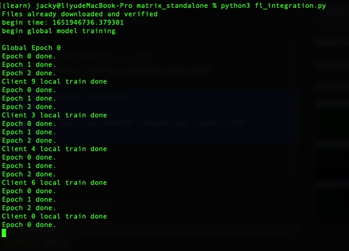
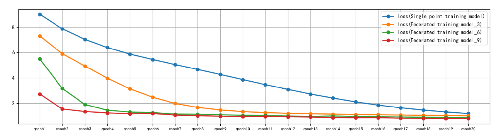
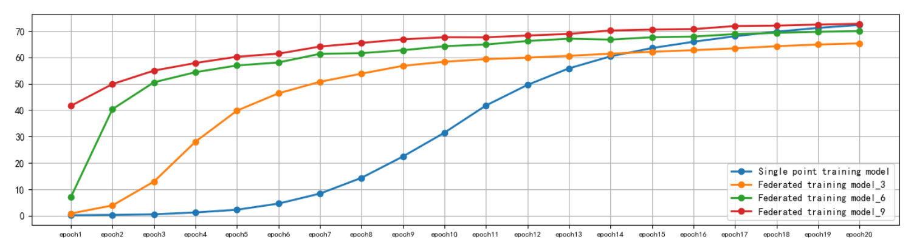

#### Matrix Standalone (Federated Learning Project)
A simple version of the horizontal federated learning project to achieve image classification learning. This project is simulated locally, and does not involve network communication details and failure processing. It only involves model aggregation functions, which can quickly verify the relevant algorithms and capabilities of federated learning.

### Operating Manual

#### Simulation Ensemble Run(fl_integration) 

```shell
python3 fl_integration.py
```

It will define a server object and multiple client objects respectively to simulate horizontal federation training scenarios.

#### Server（fl_server）

Perform model aggregation on the local model uploaded by the selected client.


#### Client（fl_client）

Receive commands and global models from the server, and use local data to train local models.


##### Functional screenshot



##### Results screenshot





_References: Federated Learning in Action_

---

### 操作手册

#### 联邦学习模拟运行集成(fl_integration) 
定义一个服务端对象和多个客户端对象，用来模拟横向联邦训练场景。
```shell
python3 fl_integration.py
```

#### 联邦学习服务端（fl_server）
将被选择的客户端上传的本地模型进行模型聚合。

#### Client（fl_client）
接收服务端的下发指令和全局模型，并利用本地数 据进行局部模型训练。

##### 功能展示


##### 结果展示


_参考资料：联邦学习实战_